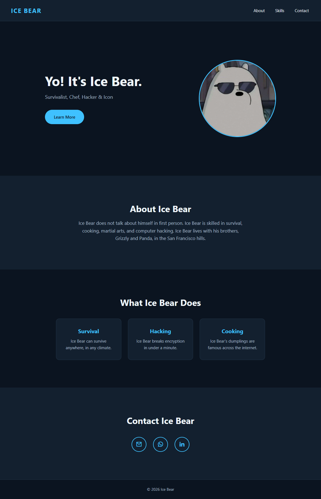

# AIESEC Web Development Workshop

A simple personal portfolio website built using **HTML and CSS** during an AIESEC web development workshop.

The goal of this project is to demonstrate how the concepts learned during the workshop can be combined to create a complete webpage.



## What You'll Learn

This project demonstrates:

- HTML page structure
- Semantic HTML elements
- Links and navigation
- Images
- CSS selectors
- Colors and typography
- The CSS Box Model
- Flexbox
- Spacing and layout

## Technologies

- HTML5
- CSS3
- Remix Icon

## Project Structure

```text
aiesec-web-workshop-portfolio/
│
├── index.html
├── style.css
├── profile.jfif
└── README.md